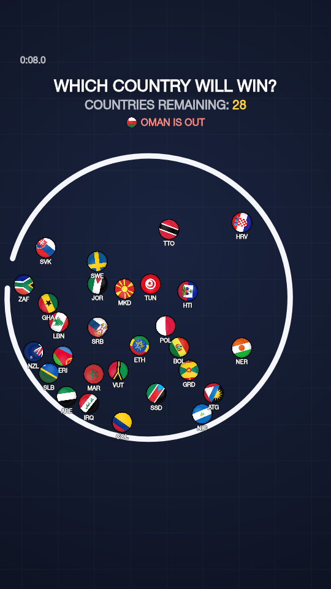
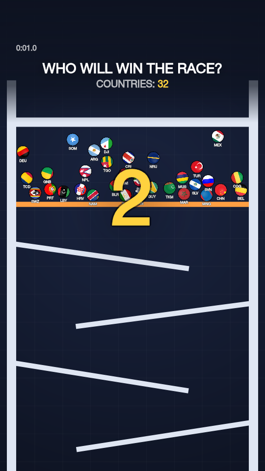
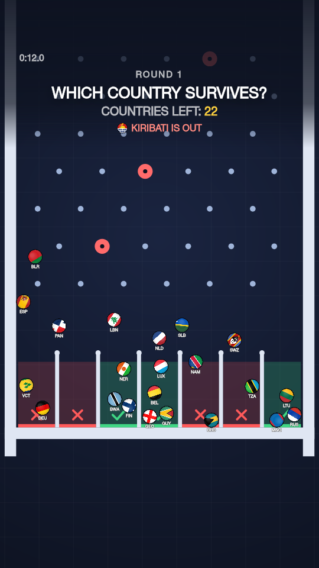
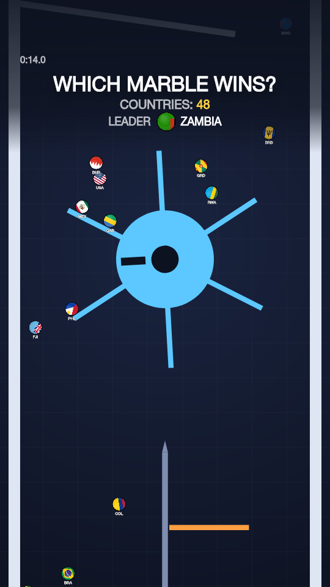
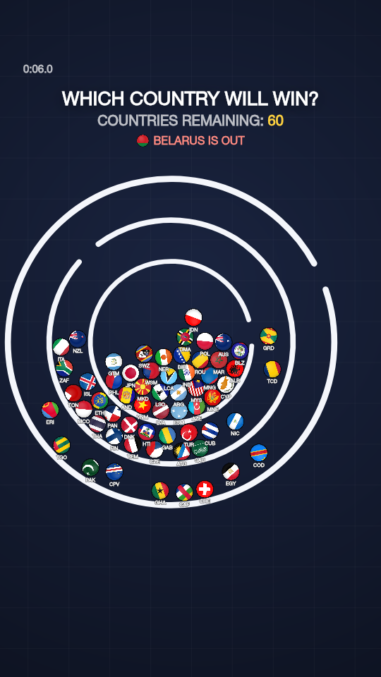
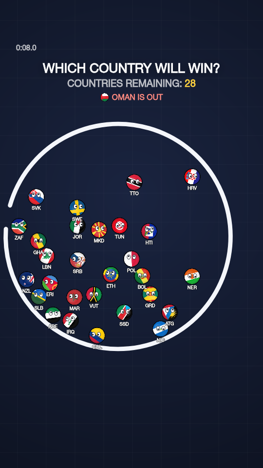
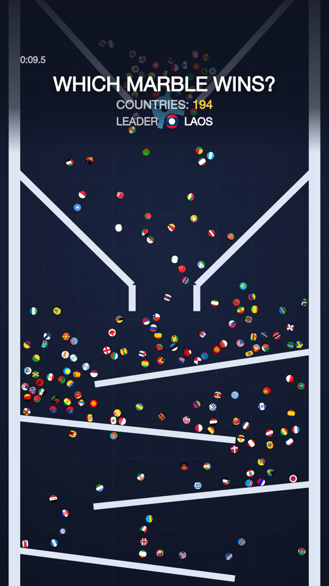
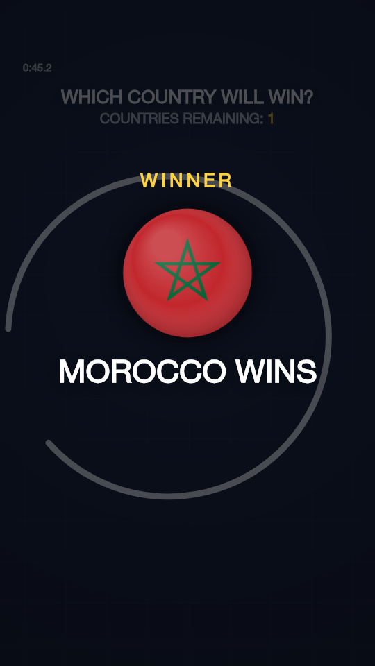

# Country Ball Physics Simulator

A deterministic 2D physics simulator where every ball is a country. Balls carry real flags, bounce, collide, race and get eliminated inside arenas and procedurally generated tracks. It's built to produce repeatable vertical (9:16) videos for YouTube Shorts, Instagram Reels and TikTok, one at a time or in batches.

<p align="center">
  
  
  
  
</p>
<p align="center">
  
  
  
  
</p>

## Goal

Pick a mode, a set of countries and a seed, then press play. **The same configuration and the same seed always produce the same simulation**, whether it plays in a browser at 60 or 144 FPS, at 0.25× or 4× speed, or headless in Node. That makes every video reproducible, so you can generate 10, 50 or 100 of them without configuring each one by hand.

## Modes

| Mode | What happens | Scenarios |
| --- | --- | --- |
| **Last Country Standing** | Everyone starts inside spinning rings. Escape the outer ring and you're out; the last country inside wins. Gaps widen over time, so every run ends. | Spinning Ring · Double Ring · Triple Ring |
| **Country Race** | Countries wait behind a gate (3-2-1-GO), then race down a seeded procedural track. First across the line wins; the podium is tracked. | Classic · Sprint · Marathon |
| **Elimination Drop** | Plinko rounds: countries drop through pegs, bumpers and spinners into slots. Green slots survive, red ones are out. Survivors go back to the top with fewer safe slots, until one is left. Each round takes 8–15 s. | Classic Plinko · Bumper Frenzy · Spinners · Tall Board |
| **Marble Race** | A marble run of ramps, tunnels, wheels, funnels, bottlenecks and moving platforms. | Grand Prix · Switchbacks · Machines |
| **Last Place Elimination** | "32 COUNTRIES / LAST PLACE IS ELIMINATED". Every round the whole field races one map; crossing the line makes a country safe (it leaves the track and waits), and the last one still on the course is out. Everyone restarts from a new seeded position each round, through FINAL 5, FINAL 3 and the FINAL ROUND. The camera follows the fight for last place. On the ring arenas, escaping the rings is the finish and the last one trapped inside is out. | All 17 maps: Plinko · Pinball · Zigzag · Funnel · Spinner · Drop · Marble Run · Hammer Alley · Crushers · Trapdoors · Tumbler · Vortex · Hurdles · Obstacle Mix · Spinning Ring · Double Ring · Triple Ring |
| **Tournament** | 8, 16, 32 or 64 countries. A seeded draw splits them into heats of up to 8, played in any mode above; the best of each heat advance to a final. | Any mode / scenario |

## Features

- **Real country data:** 250 countries and territories (194 sovereign), with names, ISO codes, region, subregion and continent.
- **Real flags,** cover-fitted into circles without distortion. Flags with emblems near the hoist (stars, cantons) are cropped toward it, and everything gets shading and an outline.
- **Real physics (Matter.js):** gravity, ball–ball and ball–wall collisions, restitution, friction, air drag, speed caps, rotation, impulses (bumpers), and kinematic obstacles (rings, spinners, wheels, sliding gates, oscillating platforms) that really push balls.
- **Procedural tracks:** `generateTrack(seed, options)` builds a track from 20 modules: Start, Drop, Zigzag, Spinner, Funnel, Plinko, Pinball, Tunnel, Jump, Platforms, Bottleneck, Wheel, Hammers, Crushers, Trapdoors, Tumbler, Bowl, Hurdles, Final Drop, Finish.
- **Obstacles from real marble races:** pendulum hammers over switchback ramps (they bat balls along or back), crushers that ram out of both walls on a timer, hinged trapdoors that drop open and snap shut (launching whoever sits on the flap), a spinning drum with three openings, a funnel-endurance bowl that balls swing across until they're slow enough to drop through, and humps to hop on steep ramps. Pendulums use a `swing` motion; rams and similar timed parts use `cycle` (fast out, hold, slow back). None of them can pin a ball: every moving part leaves at least a ball's width of room.
- **No corridors:** a corridor detector (`src/tracks/corridors.ts`) checks that no module leaves a straight vertical lane a ball could fall through untouched, for every ball size, counting moving parts by the area they sweep. Peg fields use a staggered grid (`src/tracks/grid.ts`) sized from the ball radius, with wall bumps on alternate rows; spinners, wheels and platforms get wall deflectors. It runs as a test and as `npm run corridors`.
- **Map registry:** named maps (`src/tracks/maps.ts`): 14 tracks (Plinko, Pinball, Zigzag, Funnel, Spinner, Drop, Marble Run, Hammer Alley, Crushers, Trapdoors, Tumbler, Vortex, Hurdles, Obstacle Mix) and 3 ring arenas (Spinning Ring, Double Ring, Triple Ring). A map is a fixed module sequence, seeded picks per slot, or a seeded pool. Race and Marble Race can run on any track (`config.map`, the Map selector, `--map` in the CLI); Last Place Elimination plays all 17. Every map is paced to rounds of about 8–15 s with 32 countries, measured with `npm run maps`.
- **Track editor:** pick, order and remove the modules of a race track; the geometry inside each module stays seeded.
- **Cameras:** fixed, follow leader, follow action (the leading pack, leader always in frame), follow main group. All have dynamic zoom and smoothing measured in real time.
- **Output formats:** 9:16 (1080×1920), plus 4:5, 1:1 and 16:9, with platform safe areas (TikTok/Reels/Shorts overlays) and a toggle to show them.
- **Minimal HUD on the canvas:** headline, counter, event line ("FRANCE IS OUT"), leader, timer, countdown and round banners, optional live ranking, winner and champion screens.
- **Audio:** synthesized impacts, bounces, bumpers, eliminations, lead changes, finishes, countdown and victory. Pooled buffers, per-sound cooldowns, a collision budget and a voice cap.
- **Record video:** one click replays the simulation from tick 0 and downloads a full-resolution MP4 (or WebM), with sound.
- **Content factory:** `generateSimulation({ mode, countries, track, seed, format })` plus a batch CLI that writes metadata, titles, captions, hashtags and thumbnails.
- **Country selector:** search, presets (All, continents, Random 16/32/64), continent and region filters, manual picks, exclusions and territories.
- **Determinism check:** each run shows a result fingerprint, and replaying a config reports whether the result was identical.

## Tech stack

- [Next.js](https://nextjs.org) 16 (App Router) + React 19
- TypeScript (strict, `noUncheckedIndexedAccess`)
- Tailwind CSS 4
- [Matter.js](https://brm.io/matter-js/) 0.20 for 2D rigid-body physics
- Web Audio API, MediaRecorder
- Vitest for tests, ESLint
- [@napi-rs/canvas](https://github.com/Brooooooklyn/canvas) (dev only) for headless frames and thumbnails

## Getting started

Requires Node.js 22 or newer.

```bash
npm install
npm run dev
```

Open http://localhost:3000. A simulation starts automatically as soon as the country data loads.

Keyboard shortcuts: `Space` pause/resume · `R` restart · `N` new seed · `G` generate · `.` step one tick (while paused).

Buttons: **Generate Simulation** (apply the settings) · **Restart** (same run from tick 0) · **Replay Same Seed** (last seed with the current settings) · **New Seed** · **Record video**.

| Script | What it does |
| --- | --- |
| `npm run dev` | Development server |
| `npm run build` | Production build |
| `npm run start` | Serve the production build |
| `npm run lint` | ESLint |
| `npm run typecheck` | TypeScript, no emit |
| `npm test` | Unit, determinism and mode tests (Vitest) |
| `npm run check` | Lint + typecheck + tests + build |
| `npm run generate -- …` | Content factory (see below) |
| `npm run tournament -- …` | Custom tournaments from JSON specs (see below) |
| `npm run probe -- --mode=race --runs=5` | Headless stats: duration, winner, lead changes, CPU per tick |
| `npm run maps -- --count=32 --seeds=2` | Round-length report for every map in Last Place Elimination |
| `npm run corridors` | Open-lane report for every track module, ball size and seed |
| `npm run render:frames -- --mode=race --times=0,5,end` | Render PNG frames to `output/frames` |

## Content factory

```ts
import { generateSimulation } from "@/content/generateSimulation";

const video = await generateSimulation(
  { mode: "race", countries: "all", track: "random", seed: "12345", format: "9:16" },
  countryService,
);
// video.plan      → the fully resolved, reproducible SimulationConfig
// video.result    → winner, ranking, timeline, fingerprint
// video.metadata  → title, description, caption, hashtags, thumbnail text, result line
```

`countries` accepts `"all"`, a preset (`"europe"`, `"south-america"`, `"random-32"`…), a continent name, or ISO codes (`["COL", "ARG", "BRA"]` → "Colombia vs Argentina vs Brazil"). `mode` can be any mode, `"tournament"` or `"random"`. Anything not specified is derived from the seed.

The CLI runs batches:

```bash
npm run generate -- --count=50 --mode=random --seed=batch     # batch-001 … batch-050
npm run generate -- --mode=tournament --countries=all --size=32 --seed=cup-2026
npm run generate -- --mode=marble-race --countries=asia --lang=es
npm run generate -- --mode=race --countries=COL,ARG,BRA --frames=30   # PNG sequence for ffmpeg
npm run generate -- --mode=race --video                               # MP4, needs ffmpeg on PATH
```

Each run writes `output/runs/<seed>/metadata.json` (request, config, result, tournament bracket, metadata) and `thumbnail.png`, and appends a line to `output/runs/index.jsonl`. Titles never contain the winner; the spoiler lives in `metadata.result`.

## Custom tournaments

Describe a tournament in JSON and run it headless: seeded draw, every heat, the bracket, and a thumbnail per heat.

```json
{
  "name": "Copa América de Física",
  "seed": "copa-america-2026",
  "countries": "south-america",
  "size": 8,
  "heatMode": "marble-race",
  "heatScenario": "switchbacks",
  "language": "es"
}
```

```bash
npm run tournament -- --spec=tournaments/copa-america.json
npm run tournament -- --spec=tournaments/world-cup-32.json --count=10 --seed=wc   # wc-001 … wc-010
npm run tournament -- --countries=europe --size=16 --heat-mode=marble-race --name="Euro Marbles"
npm run tournament -- --spec=tournaments/custom-track.json --frames=30            # PNG frames of the final
```

Spec fields: `name`, `seed`, `countries` (`"all"`, a preset, a continent or ISO codes), `size` (8/16/32/64), `heatMode`, `heatScenario` (or `"random"`), `track` (custom module sequence for race heats), `physics` overrides, `maxDuration`, `format`, `language`, `includeTerritories`. Invalid specs fail with a list of what to fix. Each run writes `output/tournaments/<seed>/` with `bracket.md`, `bracket.json` (every heat's ranking, qualifiers, duration and fingerprint), `metadata.json` and `heats/*.png`. Examples live in [`tournaments/`](tournaments).

## Smoothness guarantees

`src/engine/smoothness.test.ts` and `simulationLoop.test.ts` pin down what "smooth" means, for every race and marble scenario:

- no ball sits still for more than 4 s (an anti-stall nudge kicks in at 3 s), and balls crawl (< 120 px/s) less than 12% of the time
- no ball tunnels out of the track, and no ball moves much more than its speed cap in one tick (no teleports)
- more gravity always makes races faster
- cameras never jump more than 8% of the frame per 1/60 s, and follow cameras keep the leader in shot (Last Place Elimination: the country in last place); a new round is a cut, not a pan
- no track module leaves a corridor, and Elimination Drop and Last Place Elimination rounds stay at 8–15 s
- the loop plays in real time at 144, 60, 30, 5 and even 1.5 FPS, drops long stalls instead of fast-forwarding, and never spirals when the CPU can't keep up

When the display frame rate drops below 24 FPS (some embedded previews throttle animation), the results panel says so: the simulation still runs at real speed, only the drawing gets choppy.

## Environment variables

Everything works without configuration. Copy `.env.example` to `.env.local` to override.

| Variable | Default | Purpose |
| --- | --- | --- |
| `RESTCOUNTRIES_API_KEY` | unset | Use REST Countries v5 (server-side only) |
| `COUNTRIES_DATASET_URL` | mledoze/countries on jsDelivr | Override the open dataset URL |

## Country data

I evaluated the options in September 2026:

- **REST Countries** shut down v1–v4 in 2026. v5 is stable but **requires an API key**: the free tier allows 1,000 requests a month, CORS is locked to each key's hostnames, and its terms cap caching at 3 days.
- **[mledoze/countries](https://github.com/mledoze/countries)** is the open dataset (ODbL-1.0) REST Countries was originally built from. It's served by jsDelivr's CDN with no key.

The app therefore uses **mledoze/countries by default** and switches to **REST Countries v5 when `RESTCOUNTRIES_API_KEY` is set** (falling back to the open dataset if v5 fails). Continents are derived from region and subregion when the provider doesn't supply them.

**Flags** come from [flagcdn.com](https://flagcdn.com), which sends `Access-Control-Allow-Origin: *`. Drawing them keeps the canvas exportable, which video recording requires. REST Countries' own flag CDN doesn't send CORS headers.

The UI never talks to a provider directly:

```
UI ─▶ CountryService ─▶ /api/countries (Next route, 12 h in-memory cache)
        │                   └─▶ provider: open data | REST Countries v5
        └─ localStorage cache (24 h fresh; stale copy served if the API is down)
```

`CountryService` provides `getAllCountries()`, `getCountryByCode()` (alpha-2 or alpha-3), `getCountriesByRegion()`, `getCountriesByContinent()` and `searchCountries()`. It deduplicates concurrent loads, caches with a TTL, and serves the last good dataset when the upstream fails (respecting each provider's maximum stale age). The CLI uses the same service with a disk cache in `.cache/`.

## Project structure

```
src/
  app/                 Next.js app (page, layout, /api/countries route)
  countries/           CountryService, types, cache, providers, selection presets
  engine/              Framework-free simulation core
    random.ts          createRandom(seed): seeded PRNG with forked streams
    events.ts          Typed event bus
    physicsWorld.ts    Matter.js wrapper: fixed tick, sub-steps, kinematics, contacts
    simulation.ts      Simulation: entities, rules hooks, ranking, leader, results
    spawn.ts           Seeded, non-overlapping spawn placement
    camera.ts          Fixed / leader / action / group camera with smoothing
    simulationLoop.ts  requestAnimationFrame loop with accumulator + interpolation
  entities/            CountryBall, Obstacle, Zone (eliminators, goals, safe zones)
  modes/               Last Country Standing, Race, Elimination Drop, Marble Race, Last Place Elimination, Tournament
    rounds.ts          RoundManager: intro → racing → result → next round
  tracks/              generateTrack(), the 14 track modules, peg grid, corridor detector, map registry, course path
  render/              Canvas renderer, HUD, flag atlas, formats, safe areas, themes
  audio/               Synthesized, rate-limited sound engine
  content/             planSimulation, generateSimulation, metadata templates
  runtime/             SimulationController (engine ↔ canvas ↔ React), video recorder
  components/          React UI (control panel, track editor, selector, live panel)
scripts/               Node tooling: generate, probe, render-frames, headless renderer
```

The engine, tracks, modes and content modules have no DOM or React dependency, so they run identically in the browser, in tests and in Node scripts.

## Simulation architecture

- **Fixed timestep.** The simulation advances in ticks of 1/60 s, each split into 2 physics sub-steps (kinematic obstacles are posed and speeds capped before/after every sub-step). `Simulation.step()` has no notion of wall-clock time.
- **Accumulator loop.** In the browser, real elapsed time × playback speed fills an accumulator. Whole ticks are drained from it, and rendering interpolates between the last two ticks (`alpha`). Frame rate and speed decide *how many* ticks run per frame, never *what* happens in them.
- **Data-first worlds.** Modes and the track generator describe a `WorldLayout`: obstacles, zones and spawn area as plain data (shapes plus scripted motion). The engine builds Matter.js bodies from it.
- **Kinematic obstacles.** Rings, spinners, wheels, gates and platforms are static bodies posed every sub-step from an absolute function of time (or by rules, for reusable gates), with velocity handed to the solver so they push balls. No drift, identical on every replay.
- **Rules as hooks.** A mode provides `createLayout()` and rules (`beforeStep`, `afterStep`, `rank`, `progress`, `hud`, `cameraSubjects`, `onTimeout`). The engine handles eliminations, finishes, places, teleports, parking (a ball leaves the world without being decided and comes back with `unpark`), leader tracking (with hysteresis) and results. Round-based modes use `RoundManager`; start gates are opened by the mode (`startGate`), so they can close again between rounds. Tournaments are sequences of ordinary simulations with derived seeds.
- **Progress along the course.** Track modules describe the route balls take through them (e.g. along zigzag ramps); `CoursePath` measures how far along it a ball is. Last Place Elimination ranks by it, breaking ties by height, then by the previous round's finishing order, then by spawn order: never by chance.
- **Events.** `simulationStarted`, `countryEliminated`, `countryFinished`, `countryParked`, `countryTakesLead`, `leaderChanged`, `raceFinished`, `winnerDeclared`, `simulationFinished`, `roundStarted`, and `impact` (for audio). HUD, audio, UI and results subscribe; nothing listening can change the physics.
- **React stays out of the frame loop.** `SimulationController` owns the canvas, loop, audio and recorder. React reads throttled snapshots through `useSyncExternalStore`, a few times a second at most.
- **Rendering.** Flags are pre-rendered once into circular sprites; each frame is one rotated `drawImage` per ball, with off-screen culling. Everything is drawn in the format's virtual resolution (e.g. 1080×1920) and scaled to the display. HUD animations run on simulation time, so recorded frames are reproducible too.

Performance: 200 balls simulate in about 1 ms per tick on a laptop (`npm run probe -- --count=200`), and a whole 45-second game with 48 countries runs headless in under a second.

## How seeds work

Every random decision goes through `createRandom(seed)` (cyrb128 hash → sfc32 generator). `Math.random()` is never used inside simulation logic. Each subsystem forks its own stream, so adding randomness in one place doesn't reshuffle the others:

| Stream | Controls |
| --- | --- |
| `participants` | Which countries take part when more are selected than the max |
| `order` | Country order, i.e. who gets which spawn point |
| `spawn` | Spawn positions |
| `velocity` | Initial velocities and spin |
| `layout` | Arena and track generation (module picks, geometry, ring spin…) |
| `forces` | Random kicks and anti-stall nudges |
| `rounds` | Elimination Drop safe slots and respawns; Last Place Elimination starting grid for each round |
| `tournament` | Tournament entrants and draw (each heat gets `seed/rN-hM`) |
| `content` | Content-factory choices (random mode, track, preset picks, titles) |

Countries are sorted by ISO code before seeding, so the order you picked them in doesn't matter. Matter.js's global body-id counter is reset for each world. Tests run every mode and scenario twice and assert identical fingerprints.

**Same result on every machine.** JavaScript engines don't agree on the last bits of `Math.sin`, `Math.cos` or `Math.atan2` (Node 26 and Chrome 152 already differ), and physics amplifies a 1e-16 difference into a different winner within seconds. So the simulation temporarily swaps in deterministic ports of fdlibm, built only from IEEE-exact operations, while it builds its world and steps (Matter.js included). Golden-fingerprint tests pin the exact results, which have been verified identical in Node and in the browser.

## Roadmap

- [x] **Phase 1 (MVP):** GitHub repo, Next.js + TS, country API + cache, flags, CountryBall, Matter.js, 9:16 viewport, eliminations, counter, automatic winner, seeds
- [x] **Phase 2:** Race mode, obstacles, ranking, follow cameras, seeded procedural tracks, leader tracking
- [x] **Phase 3:** Track editor, Tournament, Marble Race, Elimination Drop, audio, advanced HUD (countdown, rounds, champion)
- [ ] **Phase 4, content factory:**
  - [x] `generateSimulation()`, batch CLI, metadata (EN/ES), thumbnails, browser video export
  - [x] Headless frame sequences (`--frames`) and MP4 via ffmpeg (`--video`)
  - [ ] Bundle a video encoder so headless MP4 needs no system ffmpeg
  - [ ] Intro/outro cards, music beds, caption burn-in
  - [ ] Upload/scheduling integrations

## License

[MIT](LICENSE). Country data © mledoze/countries contributors ([ODbL-1.0](https://opendatacommons.org/licenses/odbl/1-0/)); flags via flagcdn.com.
